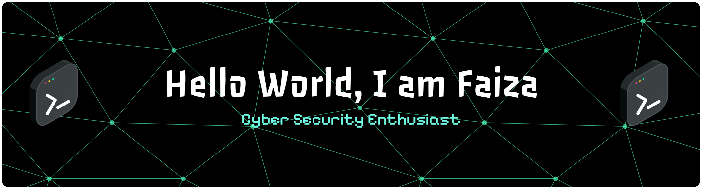

  

###

###

  
  
  

###

  

###

<h3 align="left">👩‍💻  About Me</h3>

###

I'm Faiza Alfagading S. from Computer Science at Brawijaya University, Indonesia  - 📚 I'm currently learning C, Python, and Linux - ⚙️ CTF player and Interest in Cyber ​​Security

###

###

<h3 align="left">🛠 Language and tools</h3>

###

  
  
  
  
  
  
  
  
  
  
  
  
  

###

<h3 align="left">📖 Currently Learn</h3>

###

  
  
  
  
  
  
  
  
  
  
  

###

<h3 align="left">🔥   My Stats :</h3>

###

  

###

###

  

###